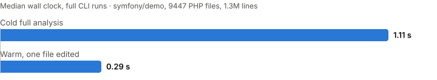

# Celerrate

[](https://github.com/celerrate/celerrate/actions/workflows/ci.yml)
[](https://github.com/celerrate/celerrate/releases/latest)
[](https://github.com/celerrate/celerrate/releases/latest)
[](#license)

**An extremely fast, all-in-one toolchain for PHP, written in Rust.**

Celerrate type-checks 1.3 million lines of PHP in 1.496 seconds
cold, and in 0.444 seconds after you edit a function body. Given the
same corpus and the same file set, that cold run is 35.9x faster than
PHPStan. Measured end to end,
[at the pinned protocol](benchmarks/PROTOCOL.md), which states the
conditions and where the ratio narrows.

> **v0.1.0, the first public release.** The engine is type-aware:
> interprocedural inference, your existing PHPDoc/PHPStan/Psalm
> annotations honored out of the box, and five diagnostic families,
> with zero configuration and without ever crashing on any input.
> The rule surface is still deliberately small, and growing.

## Installation

```sh
curl -fsSL https://raw.githubusercontent.com/celerrate/celerrate/main/install.sh | sh
```

Or, in a Composer project:

```sh
composer require --dev celerrate/celerrate
```

All channels, manual downloads, and checksum verification:
[docs/installation.md](docs/installation.md).

## Quick start

With `celerrate` installed, run it inside a Composer project:

```sh
celerrate check .
```

There is nothing to configure. Composer discovery finds your code, your
dependencies, and your PHP version range on its own:

```text
error[CEL0018]: unknown class `App\Service\Mailer`
 --> src/Controller/PostController.php:7:41
  |
7 |     public function __construct(private App\Service\Mailer $mailer)
  |                                         ^^^^^^^^^^^^^^^^^^

error[CEL0034]: accessing `format` on a possibly null `DateTimeImmutable|null`
  --> src/Notification/Mailer.php:11:16
   |
11 |         return $sentAt->format('c');
   |                ^^^^^^^^^^^^^^^

error[CEL0021]: `array_find` requires PHP 8.4, but the project's minimum PHP version is 8.1
 --> src/Service/Search.php:9:16
  |
9 |         return array_find($items, fn ($item) => $item !== null);
  |                ^^^^^^^^^^

0 notices, 3 diagnostics

for more information, run `celerrate explain CEL0018`
for more information, run `celerrate explain CEL0021`
for more information, run `celerrate explain CEL0034`
```

Every identifier ships its page in the binary:

```console
$ celerrate explain CEL0018
CEL0018: unknown class

The referenced class does not exist under any name the project can
resolve: …
```

Coming from PHPStan? One command converts your configuration and
records a baseline, so your very first `celerrate check` is already
clean and only new problems fail from there on:

```sh
celerrate migrate --from-phpstan
```

What carries over, and what deliberately does not:
[docs/migration.md](docs/migration.md).

## Performance

<picture>
  <source media="(prefers-color-scheme: dark)" srcset="assets/benchmark-dark.svg">
  
</picture>

Measured by the committed [benchmark protocol](benchmarks/PROTOCOL.md)
on symfony/demo (9447 PHP files, 1302218 lines, vendor tree
included), with type inference active, on the hardware the protocol
names:

| Scenario | Median wall clock |
| --- | --- |
| Cold full analysis | 1.496 s |
| Warm, one function body edited | **0.444 s** |
| Warm, one signature edited | 0.446 s |

All numbers are full CLI runs: process startup, cache loading,
analysis, and reporting. Peak resident memory on the same corpus is
702 MiB cold and 351 MiB warm.

Against PHPStan 2.2.7 at rule level 5, measured in the same run, in
the same working tree, with both tools given the same file set and
neither tool's result cache:

| Tool, cold | Median wall clock |
| --- | --- |
| PHPStan 2.2.7 | 53.898 s |
| Celerrate | 1.502 s |

**35.9x at that scope.** The ratio is a property of the input, not a
constant: on a small tree PHP's interpreter startup dominates
PHPStan's wall clock and the gap narrows sharply, to roughly 12x on
this corpus's `src/` alone. Neither tool's rule set is a subset of the
other's either. The protocol states all of it, and how to reproduce
both numbers.

## What works today

`celerrate check .` reports five diagnostic families
([the identifier reference](docs/diagnostics.md)):

- **Unknown symbols**: references to classes, functions, or constants
  that resolve nowhere, with your project, your Composer dependencies,
  and the bundled PHP stubs all considered.
- **PHP version gating**: symbols or syntax used outside the PHP
  version range your `composer.json` declares, including removals and
  deprecations.
- **Unknown members**: methods, properties, class constants, and enum
  cases that do not exist on the receiver's inferred type, silent on
  anything dynamic, aware of `__call`/`__get` and
  `@property`/`@method` docblocks.
- **Nullability**: dereferencing a value that may be `null`, with
  flow narrowing (`instanceof`, `isset()`, `??`, `?->` chains,
  `match`, early returns, assertion annotations) deciding what is
  still nullable at each use site.
- **Argument types**: per-argument assignability and arity, named
  arguments included, honoring each file's `declare(strict_types)`
  mode.

Around them:

- **Your annotations, honored**: standard PHPDoc, the PHPStan
  dialect, and Psalm synonyms, through the bundled
  [PHPDoc bridge](docs/phpdoc-bridge.md), including inline
  suppressions (`@phpstan-ignore-line`, `@psalm-suppress`, and
  friends).
- **Interprocedural inference**: declared types are trusted,
  unannotated returns are inferred across the call graph, generics
  are resolved for precision (and never reported on).
- **Zero configuration**: Composer discovery derives what to analyze
  and which PHP versions to check against. Installed dependencies are
  indexed but never reported on.
- **Configuration when you want it**: one optional
  [`celerrate.toml`](docs/configuration.md) at the project root pins
  the PHP version, narrows the walk, turns a rule off, or remaps a
  diagnostic between error and warning. Nothing else, and no file at
  all is a fully supported state.
- **A baseline**: `celerrate check --baseline` freezes today's
  findings in a reviewable
  [`celerrate-baseline.toml`](docs/baseline.md), so an existing
  codebase adopts Celerrate without being fixed first and only new
  problems fail the build.
- **Machine-readable output**: `--output=json|sarif|github`, one
  format per run, the same diagnostics and the same exit code in each
  ([output formats](docs/output-formats.md)).
- **`celerrate migrate --from-phpstan`**: converts a PHPStan
  configuration, reports every setting that does not carry over, and
  records a baseline ([migrating from PHPStan](docs/migration.md)).
- **Fixes on request**: diagnostics carry byte-precise suggestions.
  `--fix-suggestions` applies them, per file and atomically, in a
  deterministic order. `--fix` is the safe-only gate; every fix in
  this release is classified needs-review, so `--fix` alone applies
  nothing yet.
- **`celerrate explain CEL0034`**: every identifier ships its page,
  with a failing and a fixed example, inside the binary
  ([the identifier reference](docs/diagnostics.md)).
- **CI in one step**: install, then `celerrate check --output=github`
  for inline pull-request annotations, or `--output=sarif` for code
  scanning ([continuous integration](docs/ci.md)).
- **`--watch`**: re-analysis on every change.
- **A persistent cache** (`.celerrate/cache/`, self-ignoring): warm
  runs reuse everything that did not change, across processes,
  inferred types included.

### What it does not do yet

No language server and no editor integration, no formatter, no lint
or style rule group, no security taint analysis: `celerrate check`
today is the correctness group and nothing else.
Generic mismatches are not reported (generics serve precision only),
and unannotated parameters are treated as `mixed`.
Linux and macOS are tier 1; Windows is built and tested but stays
tier 2 for analysis correctness. Distribution is the install script
and Composer: no Homebrew formula, no Docker image, and no GitHub
Action yet. Those are the next sub-projects, in the
[roadmap](#roadmap)'s order.

## One engine, a whole toolchain

Every Celerrate command is a view over the same incremental semantic
model. Index a project once; everything else is a query:

- **`celerrate check`**: static analysis with interprocedural type
  inference, plus lint, security taint, and architecture rule groups.
  One command answers "is my code OK?".
- **`celerrate format`**: an opinionated, lossless formatter.
- **`celerrate lsp`**: a language server with the same diagnostics as
  CI, at typing speed.
- **`celerrate migrate` / `celerrate generate`**: automated refactoring
  and semantic code generation. `migrate --from-phpstan` ships today;
  the rest builds on the same model.

Speed stays a feature throughout: a Rust core, parallel by default,
incremental by construction. Diagnostics are meant to teach: annotated
spans, the engine's reasoning, concrete suggestions, and safe automatic
fixes. Extensibility is designed in: first-party plugins in Rust,
community plugins through a sandboxed WASM API.

## Built to be trusted

The engineering rules behind the numbers, enforced mechanically in CI:

- **Zero panic**: clippy denies `unwrap`, `expect`, indexing, and
  `panic` across the workspace; `unsafe` code is forbidden.
- **No input can crash it**: parsers and loaders produce diagnostics,
  never failures. Fuzzing keeps them honest.
- **Deterministic**: every analysis result is a pure function of its
  inputs. Same input, same output, on any machine.
- **Incremental by construction**: invalidation is computed, not
  guessed; warm runs reuse everything that did not change.
- **Measured, not claimed**: performance numbers come from a committed,
  reproducible benchmark protocol.
- **Test-driven**: no production code without a test that demanded it.

## Compatibility

Celerrate targets PHP 8.1+ projects. It defines its own type annotation
norm and ships a first-party [PHPDoc bridge](docs/phpdoc-bridge.md),
enabled by default, so existing annotated codebases work on day 1.

## Roadmap

`celerrate check` with the correctness group is v0.1.0, the first
public deliverable. What follows, one pillar at a time, in this order
and without dates:

1. **Framework providers**: dynamic type providers for Eloquent magic
   members and builder chains, Laravel facades, and the Symfony
   container. Laravel joins the measured corpus when this ships.
2. **`celerrate lsp`** and a daemon mode: the same incremental engine
   answering at typing speed, so an editor and CI report the same
   diagnostics.
3. **The remaining rule groups**: security taint analysis first, then
   lint and style, then architecture rules, all on the model
   `celerrate check` already builds.
4. **`celerrate format`**: the formatter, once the lossless syntax
   tree is proven by the analyzer.
5. **More distribution channels**: a Homebrew formula, a Docker image,
   and a GitHub Action alongside the install script and Composer.

## Contributing

Contributions are welcome: see [CONTRIBUTING.md](CONTRIBUTING.md). The
engineering rules above are enforced by CI, not by review comments.

## License

Dual-licensed under either of:

- MIT license ([LICENSE-MIT](LICENSE-MIT))
- Apache License, Version 2.0 ([LICENSE-APACHE](LICENSE-APACHE))

at your option. "Celerrate" is a trademark of JDevelop.

### Contribution

Unless you explicitly state otherwise, any contribution intentionally
submitted for inclusion in the work by you, as defined in the
Apache-2.0 license, shall be dual licensed as above, without any
additional terms or conditions.
